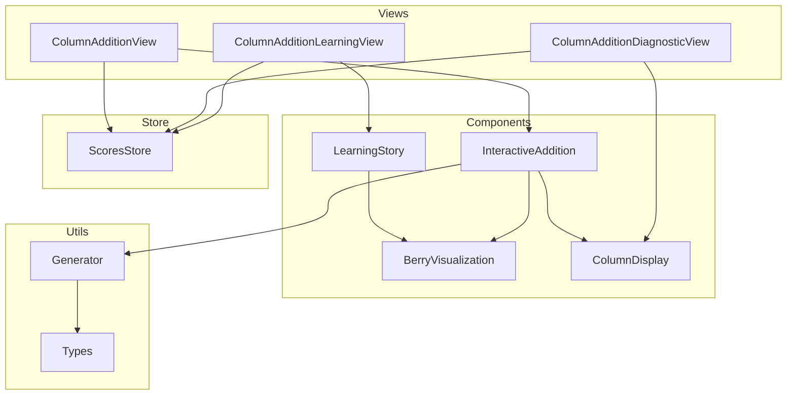
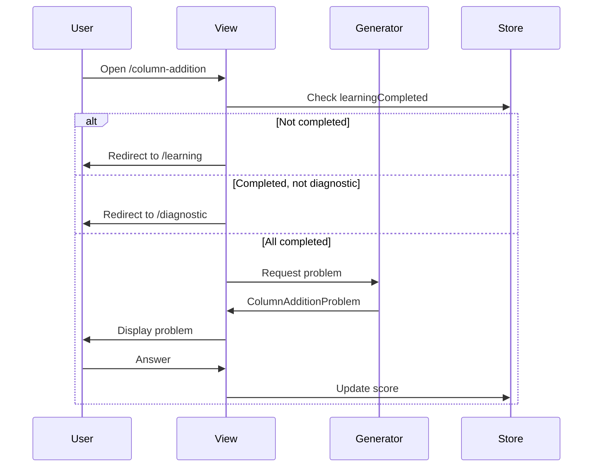
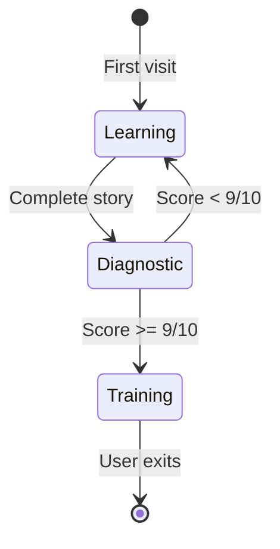

# PRD: Сложение в столбик (Column Addition)

**Дата:** 12 февраля 2026
**Версия:** 1.1
**Статус:** AI-Optimized & Template-Compliant
**Предыдущая версия:** 1.0 (AI-Optimized), 0.1 (Черновик концепции)

---

## Table of Contents

- [1. Executive Summary](#1-executive-summary)
- [2. Problem Statement](#2-problem-statement)
- [3. Goals & Metrics](#3-goals--metrics)
- [4. Non-Goals](#4-non-goals)
- [5. User Personas](#5-user-personas)
- [6. Ключевые концепции](#6-ключевые-концепции)
- [7. Functional Requirements](#7-functional-requirements)
- [8. Non-Functional Requirements](#8-non-functional-requirements)
- [9. Architecture](#9-architecture)
- [10. Risk Assessment](#10-risk-assessment)
- [11. Dependencies](#11-dependencies)
- [12. Implementation Phases](#12-implementation-phases)
- [13. Existing Patterns Reference](#13-existing-patterns-reference)
- [14. Testing Requirements](#14-testing-requirements)
- [15. Design Compliance Checklist](#15-design-compliance-checklist)
- [Appendix A: Storyboard](#appendix-a-storyboard)
- [Appendix B: Glossary](#appendix-b-glossary)

---

## 1. Executive Summary

**Vision:** Создать интерактивное упражнение "Сложение в столбик" для учеников 2-3 классов, которое решает фундаментальную проблему непонимания концепции переноса через десяток.

**Ключевая ценность:** Метафора "Сбор ягод" превращает абстрактную операцию в понятную визуальную историю.

**Интеграция:** Полностью следует паттернам MathTrainer: `useGameLogic`, `MathProblem`, система монет/очков.

**Scope:** Только двузначные числа (10-99), один перенос максимум.

---

## 2. Problem Statement

### 2.1 Основные проблемы

| ID | Проблема | Описание | Частота | Последствия |
|----|----------|----------|---------|-------------|
| P-1 | Забывание переноса | Складывает единицы, забывает добавить десяток | ~35% | 27 + 15 = 32 |
| P-2 | Непонимание "откуда 1" | Не понимает цифру над разрядом | ~25% | Ошибки в 47 + 35 |
| P-3 | Лишний перенос | Переносит когда не нужно | ~20% | 23 + 15 = 39 |
| P-4 | Абстрактность | Перенос через разряд слишком абстрактен | ~15% | Отсутствие интуиции |

### 2.2 Метрики проблемы

- **55%** учеников 2-3 классов делают ошибки с переходом через десяток
- **35%** ошибок — "забыл перенести"
- **20%** ошибок — "лишний перенос"

### 2.3 Сравнение с вычитанием

| Аспект | Вычитание (есть) | Сложение (новое) |
|--------|------------------|------------------|
| Операция | Заимствование | Перенос |
| Метафора | "Вскрытие пачки" | "Наполнение корзины" |
| Направление | 10 → 1+10 | 10 → 1 корзина |

---

## 3. Goals & Metrics

### 3.1 SMART Goals

| ID | Цель | Метрика | Target | Приоритет |
|----|------|---------|--------|-----------|
| G-1 | Понимание когда нужен перенос | Диагностика 9/10 | ≥80% учеников | P0 |
| G-2 | Корректный перенос | Примеры с переносом | ≥75% правильно | P0 |
| G-3 | Завершение обучения | % завершения | ≥85% | P1 |
| G-4 | Нет лишнего переноса | Примеры без переноса | ≥90% правильно | P1 |

### 3.2 Success Metrics

| Категория | Метрика | Baseline | Target | Измерение |
|-----------|---------|----------|--------|-----------|
| Обучение | learningCompleted | — | 85% | analytics |
| Диагностика | diagnosticPassRate | — | 80% | 9/10 correct |
| Навык | forgotCarry errors | 35% | <10% | wrongOptionType |
| Навык | extraCarry errors | 20% | <5% | wrongOptionType |
| Вовлечение | returnToPractice | — | 60% | return rate |

---

## 4. Non-Goals

**Чего НЕ делаем в v1.0:**

| ID | Non-Goal | Причина | Когда возможно |
|----|----------|---------|----------------|
| NG-1 | Трёхзначные числа | Сложность для 2-3 класс | v2.0 |
| NG-2 | Внешние графические движки | Vue+CSS+SVG достаточно | — |
| NG-3 | Multiplayer | Не входит в scope | v3.0+ |
| NG-4 | Адаптивная сложность | Требует ML | v2.0 |
| NG-5 | Множественный перенос | Редкий случай | v2.0 |

---

## 5. User Personas

### 5.1 Дима, 8 лет (2 класс) — Primary

**Профиль:**
- Визуал, понимает через картинки
- Боли: "Зачем эта единичка сверху?"

**Сценарий:**
> Дима решает 27 + 15. Складывает 7 + 5 = 12, пишет 2, забывает про десяток → 32. BerryVisualization показывает: 7 ягод + 5 = 12, собираем 10 в корзину, осталось 2 + 1 новая корзина. Десятки: 2 + 1 + 1 = 4. Ответ: 42!

### 5.2 Аня, 9 лет (3 класс) — Secondary

**Профиль:**
- Знает алгоритм, но делает ошибки невнимательности
- Мотивация: быстро пройти диагностику

### 5.3 Родитель (папа Димы) — Stakeholder

**Профиль:**
- Хочет понимание, не заучивание
- Доверяет интерактивным методам

---

## 6. Ключевые концепции

### 6.1 Метафора "Сбор ягод"

| Математика | Ягоды | Визуал |
|------------|-------|--------|
| Единица (1) | Ягода | 🔴 |
| Десяток (10) | Полная корзина | 🧺 |
| Перенос | 10 ягод → 1 корзина | Анимация |

### 6.2 Типы примеров

| Тип | Пример | Перенос | Сложность | Частота |
|-----|--------|---------|-----------|---------|
| no-carry | 23 + 15 = 38 | Нет | Easy | 30% |
| with-carry | 27 + 15 = 42 | Да | Medium | 40% |
| round-number | 30 + 45 = 75 | Нет/Да | Easy | 15% |
| trap-no-carry | 32 + 14 = 46 | Нет (кажется да) | Medium | 15% |

### 6.3 Ловушки в вариантах ответов

| Ловушка | Пример | Когда |
|---------|--------|-------|
| forgot-carry | 27+15→32 | with-carry |
| extra-carry | 23+15→39 | no-carry |
| wrong-units | 27+15→41 | random |
| wrong-tens | 27+15→52 | random |

---

## 7. Functional Requirements

### FR-001: Типы данных и генератор [P0]

**Описание:** Тип `ColumnAdditionProblem` и генератор задач

**TypeScript Interface:**
```typescript
interface ColumnAdditionProblem extends MathProblem {
  addend1: number;          // Первое слагаемое (10-99)
  addend2: number;          // Второе слагаемое (10-99)
  sum: number;              // Сумма
  needsCarry: boolean;      // Нужен перенос
  problemType: 'with-carry' | 'no-carry' | 'round-number' | 'trap-no-carry';
  units1: number;           // Единицы первого
  units2: number;           // Единицы второго
  unitsSum: number;         // Сумма единиц
  tens1: number;            // Десятки первого
  tens2: number;            // Десятки второго
  tensSum: number;          // Сумма десятков с переносом
  expression: string;       // "27 + 15"
  correctAnswer: number;    // 42
  options: string[];        // ["42", "32", "47", "52"]
  correctIndex: number;     // 0
  difficulty: 1 | 2 | 3 | 4;
}
```

**Acceptance Criteria (GWT):**
```
GIVEN генератор вызван с totalScore=0
WHEN генерируется 100 задач
THEN распределение типов: with-carry~40%, no-carry~30%, round-number~15%, trap~15%
AND все addend1, addend2 в диапазоне 10-99
AND все sum в диапазоне 20-198
AND forgot-carry вариант присутствует в 100% with-carry задач
```

**Файлы:** `src/types/index.ts`, `src/utils/math/columnAddition/index.ts`

---

### FR-002: Store и маршрутизация [P0]

**Описание:** Интеграция с существующей системой

**Store изменения:**
```typescript
// src/store/scores.ts
interface ScoresState {
  // ... existing
  columnAdditionScore: number;
  columnAdditionLearningCompleted: boolean;
  columnAdditionDiagnosticPassed: boolean;
}

// Methods
updateColumnAdditionScore(points: number): void
setColumnAdditionLearningCompleted(): void
setColumnAdditionDiagnosticPassed(): void
```

**Routes:**
```
/column-addition           → ColumnAdditionView
/column-addition/learning  → ColumnAdditionLearningView
/column-addition/diagnostic→ ColumnAdditionDiagnosticView
```

**Acceptance Criteria (GWT):**
```
GIVEN пользователь не прошёл обучение
WHEN переходит на /column-addition
THEN редирект на /column-addition/learning

GIVEN пользователь прошёл обучение, не диагностику
WHEN переходит на /column-addition
THEN редирект на /column-addition/diagnostic

GIVEN пользователь прошёл диагностику
WHEN переходит на /column-addition
THEN показывается ColumnAdditionView
```

**Файлы:** `src/store/scores.ts`, `src/router/index.ts`, `src/utils/gradeHelpers.ts`

---

### FR-003: Компонент ColumnDisplay [P1]

**Описание:** Переиспользуемая визуализация столбика

**Props:**
```typescript
interface ColumnDisplayProps {
  topNumber: number;        // Верхнее число
  bottomNumber: number;     // Нижнее число
  operation: '+' | '-';     // Операция
  result?: number;          // Результат (опционально)
  carry?: 0 | 1;            // Перенос/заимствование
  highlightColumn?: 'units' | 'tens';
  showAnimation?: boolean;
}
```

**Acceptance Criteria (GWT):**
```
GIVEN ColumnDisplay с topNumber=27, bottomNumber=15, operation='+'
WHEN компонент рендерится
THEN отображается:
  - " 2 7" сверху
  - "+1 5" снизу
  - черта под bottomNumber
  - "?" или result в нижней строке

GIVEN needsCarry=true AND showAnimation=true
WHEN пользователь вводит правильные единицы
THEN появляется анимация цифры "1" над десятками
```

**Файл:** `src/components/columnMath/ColumnDisplay.vue`

---

### FR-004: Компонент BerryVisualization [P0]

**Описание:** Визуализация ягод и корзин

**Props:**
```typescript
interface BerryVisualizationProps {
  baskets: number;          // Количество полных корзин
  looseBerries: number;     // Ягоды россыпью (0-9)
  maxToShow?: number;       // Максимум отображаемых
  fillingBasketIndex?: number;
  collectingCount?: number;
  showTotal?: boolean;
}
```

**SVG Icons:**
```typescript
// src/components/columnAddition/svgIcons.ts
berryIcon: SVG // Красный круг ~24px, зелёный листик
emptyBasketIcon: SVG // Коричневая корзина ~50x45px
fullBasketIcon: SVG // Корзина с 4-5 видимыми ягодами
```

**Acceptance Criteria (GWT):**
```
GIVEN baskets=2, looseBerries=7
WHEN компонент рендерится
THEN отображается 2 fullBasketIcon + 7 berryIcon
AND description: "2 корзины + 7 ягод"

GIVEN looseBerries >= 10
WHEN вызывается collectToBasket()
THEN 10 ягод анимированно собираются в корзину
AND baskets увеличивается на 1
AND looseBerries уменьшается на 10
```

**Файлы:** `src/components/columnAddition/BerryVisualization.vue`, `src/components/columnAddition/svgIcons.ts`

---

### FR-005: Компонент LearningStory [P0]

**Описание:** 6-шаговая интерактивная история

**Шаги:**

| Шаг | Визуал | Текст | Действие |
|-----|--------|-------|----------|
| 0 | 2 корзины + 7 ягод | "На поляне 2 корзины и 7 ягод. Всего: 27" | Кнопка "Понятно" |
| 1 | Анимация +5 ягод | "Собрал ещё 5. Сколько россыпью?" | Выбор: 12/7/5 |
| 2 | 2 корзины + 12 ягод | "12 россыпью — неудобно! Что делать?" | Выбор: Собрать/Оставить |
| 3 | Анимация 10→корзина | "Сколько полных корзин?" | Выбор: 1/2/3 |
| 4 | 3 корзины + 2 ягоды | "Сколько осталось россыпью?" | Выбор: 2/10/12 |
| 5 | Столбик 27+15 | "Десятки: 2+1+1=?" | Ввод: 4 |

**Acceptance Criteria (GWT):**
```
GIVEN пользователь на шаге 1
WHEN выбирает "12"
THEN showCorrect=true, появляется кнопка "Далее"
AND currentStep++ при клике

GIVEN пользователь ошибается 3 раза
WHEN на любом шаге
THEN показывается правильный ответ
AND кнопка "Далее" для продолжения

GIVEN пользователь завершил шаг 5
WHEN кликает "Завершить"
THEN emit('complete')
AND store.setColumnAdditionLearningCompleted()
```

**Файл:** `src/components/columnAddition/LearningStory.vue`

---

### FR-006: Learning View [P0]

**Описание:** Полноэкранный режим обучения

**Acceptance Criteria (GWT):**
```
GIVEN learningCompleted=false
WHEN пользователь открывает /column-addition
THEN редирект на /column-addition/learning

GIVEN пользователь на LearningView
WHEN кликает "Выйти"
THEN редирект на /

GIVEN пользователь завершил LearningStory
WHEN emit('complete')
THEN learningCompleted=true
AND редирект на /column-addition/diagnostic
```

**Файл:** `src/views/ColumnAdditionLearningView.vue`

---

### FR-007: Diagnostic View [P0]

**Описание:** 10 примеров для оценки готовности

**Структура:**
- 3 примера with-carry
- 3 примера no-carry
- 2 примера round-number
- 2 примера trap-no-carry

**Acceptance Criteria (GWT):**
```
GIVEN пользователь на DiagnosticView
WHEN отвечает на 10 вопросов
THEN correctAnswers подсчитывается

GIVEN correctAnswers >= 9
WHEN завершается диагностика
THEN diagnosticPassed=true
AND редирект на /column-addition

GIVEN correctAnswers < 9
WHEN завершается диагностика
THEN показывается сообщение "Рекомендуем повторить обучение"
AND кнопка "Пройти обучение" → /column-addition/learning
```

**Файл:** `src/views/ColumnAdditionDiagnosticView.vue`

---

### FR-008: Training View [P0]

**Описание:** Основной режим тренировки

**Acceptance Criteria (GWT):**
```
GIVEN пользователь на TrainingView с примером 27+15
WHEN вводит правильный ответ
THEN score обновляется
AND следующий пример

GIVEN пользователь ошибается
WHEN wrongAnswer
THEN показывается подсказка:
  - 1-я ошибка: "Проверь единицы: 7+5=?"
  - 2-я ошибка: "Не забудь добавить перенесённый десяток!"
  - 3-я ошибка: Автопоказ с BerryVisualization

GIVEN клик "Показать что происходит"
WHEN показывается BerryVisualization
THEN визуализация текущего шага сложения
```

**Файл:** `src/views/ColumnAdditionView.vue`

---

### FR-009: HomeView Integration [P1]

**Описание:** Карточка упражнения на главном экране

**Acceptance Criteria (GWT):**
```
GIVEN !learningCompleted
WHEN рендерится карточка
THEN кнопка: "Начать обучение"

GIVEN learningCompleted AND !diagnosticPassed
WHEN рендерится карточка
THEN кнопка: "Проверить знания"

GIVEN diagnosticPassed
WHEN рендерится карточка
THEN кнопка: "Тренироваться"
```

**Файл:** `src/views/HomeView.vue`

---

## 8. Non-Functional Requirements

| ID | Требование | Значение | Измерение |
|----|------------|----------|-----------|
| NFR-001 | Время отклика UI | < 100ms | Lighthouse |
| NFR-002 | Bundle size增量 | < 15KB gzip | webpack-analyzer |
| NFR-003 | Доступность | WCAG 2.1 AA | axe DevTools |
| NFR-004 | Браузеры | Chrome 90+, Safari 14+, Firefox 90+ | BrowserStack |
| NFR-005 | Responsive | 320px minimum | Chrome DevTools |
| NFR-006 | Анимации | 60fps | Performance tab |
| NFR-007 | Сохранение | Real-time | Manual test |

**Цветовая схема:**

```css
--ca-primary: #667eea;
--ca-berry: #DC143C;
--ca-basket: #8B4513;
--ca-leaf: #228B22;
```

---

## 9. Architecture

### 9.1 Component Diagram



### 9.2 Data Flow



### 9.3 State Machine



### 9.4 File Structure

```
src/
├── types/index.ts                    # + ColumnAdditionProblem
├── store/scores.ts                   # + columnAddition fields
├── router/index.ts                   # + /column-addition/* routes
├── utils/
│   ├── math/columnAddition/
│   │   └── index.ts                  # Generator + helpers
│   └── gradeHelpers.ts               # + exercise config
├── components/
│   ├── columnAddition/
│   │   ├── svgIcons.ts
│   │   ├── BerryVisualization.vue
│   │   ├── LearningStory.vue
│   │   └── InteractiveAddition.vue
│   └── columnMath/
│       └── ColumnDisplay.vue         # Shared with subtraction
└── views/
    ├── ColumnAdditionView.vue
    ├── ColumnAdditionLearningView.vue
    └── ColumnAdditionDiagnosticView.vue
```

---

## 10. Risk Assessment

| ID | Риск | Вероятность | Влияние | Митигация |
|----|------|-------------|---------|-----------|
| R-1 | Дети не поймут метафору ягод | Medium | High | A/B тест с альтернативой; skip button |
| R-2 | Анимации тормозят на старых устройствах | Low | Medium | CSS-only анимации; prefers-reduced-motion |
| R-3 | Переиспользование ColumnDisplay сломает вычитание | Medium | High | Unit tests перед merge; отдельные props |
| R-4 | Диагностика слишком сложная | Medium | Medium | Настраиваемый проходной балл |
| R-5 | Store дублирование с вычитанием | Low | Low | Общий интерфейс для column operations |

---

## 11. Dependencies

### 11.1 Internal Dependencies

| Зависимость | Тип | Статус |
|-------------|-----|--------|
| `useGameLogic` composable | Required | ✅ Exists |
| `useCoins` composable | Required | ✅ Exists |
| `ScoresStore` | Required | ✅ Exists |
| `MathProblem` type | Required | ✅ Exists |
| `ColumnSubtraction` patterns | Reference | ✅ Exists |

### 11.2 External Dependencies

| Зависимость | Версия | Назначение |
|-------------|--------|------------|
| Vue 3 | ^3.3 | Framework |
| Vue Router | ^4.2 | Routing |
| Pinia | ^2.1 | Store |

---

## 12. Implementation Phases

### Phase 1: Foundation (~2h)

| ID | Task | Estimate | Depends | Deliverable |
|----|------|----------|---------|-------------|
| 1.1 | Define `ColumnAdditionProblem` interface | 15m | — | types/index.ts |
| 1.2 | Implement `needsCarry()` helper | 10m | 1.1 | generator |
| 1.3 | Implement `generateWrongOptions()` | 20m | 1.1 | generator |
| 1.4 | Implement main generator | 25m | 1.2, 1.3 | generator |
| 1.5 | Unit tests for generator | 20m | 1.4 | tests |
| 1.6 | Add store fields | 15m | — | store/scores.ts |
| 1.7 | Add routes | 15m | — | router/index.ts |
| 1.8 | Add to AvailableExercises | 10m | — | gradeHelpers.ts |

**Checkpoint:** `npm run test` passes, routes work

---

### Phase 2: Visualization (~2.5h)

| ID | Task | Estimate | Depends | Deliverable |
|----|------|----------|---------|-------------|
| 2.1 | Create berry SVG icon | 20m | — | svgIcons.ts |
| 2.2 | Create basket SVG icons | 25m | — | svgIcons.ts |
| 2.3 | BerryVisualization component | 45m | 2.1, 2.2 | .vue file |
| 2.4 | CSS animations | 30m | 2.3 | styles |
| 2.5 | Refactor/create shared ColumnDisplay | 45m | — | columnMath/ |

**Checkpoint:** BerryVisualization renders correctly

---

### Phase 3: Learning Mode (~2h)

| ID | Task | Estimate | Depends | Deliverable |
|----|------|----------|---------|-------------|
| 3.1 | Create LearningStory component | 60m | 2.3 | .vue file |
| 3.2 | Implement Step 0-5 logic | 30m | 3.1 | component |
| 3.3 | Create LearningView | 20m | 3.2 | .vue file |
| 3.4 | Integration testing | 10m | 3.3 | manual test |

**Checkpoint:** Full learning flow works

---

### Phase 4: Diagnostic Mode (~1h)

| ID | Task | Estimate | Depends | Deliverable |
|----|------|----------|---------|-------------|
| 4.1 | Create DiagnosticView | 30m | 1.4 | .vue file |
| 4.2 | Implement 10-problem generator | 15m | 1.4 | function |
| 4.3 | Pass/fail logic | 15m | 4.1 | component |

**Checkpoint:** Diagnostic flow works

---

### Phase 5: Training Mode (~1.5h)

| ID | Task | Estimate | Depends | Deliverable |
|----|------|----------|---------|-------------|
| 5.1 | Create TrainingView | 40m | 1.4, 2.5 | .vue file |
| 5.2 | Integrate useGameLogic | 20m | 5.1 | component |
| 5.3 | Implement hints system | 30m | 5.1 | component |

**Checkpoint:** Training flow works

---

### Phase 6: Integration (~1h)

| ID | Task | Estimate | Depends | Deliverable |
|----|------|----------|---------|-------------|
| 6.1 | Add card to HomeView | 20m | — | HomeView.vue |
| 6.2 | End-to-end testing | 20m | 6.1 | manual test |
| 6.3 | Fix bugs | 20m | 6.2 | — |

**Checkpoint:** Full flow works, ready for review

---

**Total Estimate:** ~10 hours

---

## 13. Existing Patterns Reference

> 🎯 **КРИТИЧЕСКИ ВАЖНО:** Этот раздел гарантирует использование существующих компонентов вместо создания дубликатов.

### 13.1 Обязательные общие компоненты

| Компонент | Путь | Обязательные props | События | Использование |
|-----------|------|-------------------|---------|---------------|
| GameOver | `src/components/common/GameOver.vue` | correctAnswers, totalAnswers, score | @restart, @exit | После завершения тренировки |
| CoinAnimation | `src/components/common/CoinAnimation.vue` | amount, showText?, duration? | @animationEnd | При awardCoins |
| ScoreDisplay | `src/components/common/ScoreDisplay.vue` | currentScore, totalScore, currentQuestion, totalQuestions | — | Отображение прогресса |
| ProgressBar | `src/components/common/ProgressBar.vue` | progressPercent | — | Визуальный прогресс |
| StarRating | `src/components/common/StarRating.vue` | score | — | Рейтинг по звёздам |
| AnswerOptions | `src/components/common/AnswerOptions.vue` | options[], correctIndex, answered, selectedIndex | @answer-selected | Выбор ответа |
| CurrencyDisplay | `src/components/player/CurrencyDisplay.vue` | (нет, использует playerStore) | — | Отображение валюты |

### 13.2 Обязательная структура DOM View-компонента

```
app-container
├── CoinAnimation (условный рендеринг v-if="showCoinAnimation")
└── game-container
    ├── .header
    │   ├── button.back-button (← Назад)
    │   ├── span.level-indicator (Уровень X)
    │   └── CurrencyDisplay
    ├── game-container-inner (v-if="!game.gameOver.value")
    │   ├── h1.title (Сложение в столбик)
    │   ├── ScoreDisplay
    │   ├── [InteractiveAddition / ColumnDisplay] — специфичный компонент
    │   ├── [BerryVisualization] — опционально
    │   ├── game-container-footer
    │   │   ├── ProgressBar
    │   │   └── StarRating
    │   └── AnswerOptions (если не интерактивный режим)
    └── GameOver (v-else)
```

### 13.3 Синтаксис компонентов

**Правило выбора синтаксиса:**

| Тип компонента | Синтаксис | Пример |
|----------------|-----------|--------|
| **View-компоненты** (ColumnAdditionView, Learning, Diagnostic) | Options API | `ColumnSubtractionView.vue` |
| **Display-компоненты** (ColumnDisplay, BerryVisualization) | `<script setup>` | `ShopVisualization.vue` |
| **Common-компоненты** | `<script setup>` | `ScoreDisplay.vue` |

❌ **НЕПРАВИЛЬНО для View:**
```vue
<script setup lang="ts">
import { ref } from 'vue'
const score = ref(0)
</script>
```

✅ **ПРАВИЛЬНО для View:**
```vue
<script lang="ts">
import { ref } from 'vue';
import { useGameLogic } from '@/composables/useGameLogic';

export default {
  name: 'ColumnAdditionView',
  components: { ScoreDisplay, ProgressBar, /* ... */ },
  setup() {
    const game = useGameLogic(TRAINING_QUESTIONS_COUNT);
    return { game };
  }
}
</script>
```

### 13.4 Обязательные Composables

| Composable | Путь | Назначение | Использование |
|------------|------|------------|---------------|
| useGameLogic | `src/composables/useGameLogic.ts` | Управление состоянием игры | `const game = useGameLogic(10)` |
| useCoins | `src/composables/useCoins.ts` | Анимация и выдача монет | `const { awardCoins } = useCoins()` |
| useScoresStore | `src/store/scores.ts` | Хранение очков упражнения | `scoresStore.updateColumnAdditionScore(points)` |

### 13.5 Reference Implementations

> ⚠️ **Внимание:** Номера строк могут устареть. Проверьте актуальность.

**View-компонент для копирования:** `src/views/ColumnSubtractionView.vue`
- Header структура: строки 12-20
- ScoreDisplay использование: строки 23-28
- InteractiveSubtraction использование: строки 31-42
- GameOver использование: строки 61-68
- CoinAnimation использование: строки 4-8
- useGameLogic интеграция: строки 107-108

**Генератор задач:** `src/utils/math/columnSubtraction/index.ts`
- Функция generateColumnSubtractionProblem
- Функция generateWrongOptions

**Learning Story:** `src/components/columnSubtraction/LearningStory.vue`
- 6-шаговая структура
- ShopVisualization интеграция
- Система подсказок при ошибках

**Visualization:** `src/components/columnSubtraction/ShopVisualization.vue`
- SVG иконки из svgIcons.ts
- CSS анимации
- Props интерфейс

### 13.6 CSS — НЕ дублировать!

**Глобальные классы из `src/assets/css/main.css` — ИСПОЛЬЗОВАТЬ, НЕ КОПИРОВАТЬ:**

```css
/* УЖЕ ЕСТЬ в main.css — НЕ дублировать в scoped styles! */
.back-button { /* строки 326-357 */ }
.level-indicator { /* строки 66-74 */ }
.app-container { /* строки 18-25 */ }
.game-container { /* строки 27-37 */ }
.title { /* строки 55-64 */ }
```

**Стратегия scoped styles:**

✅ **ПРАВИЛЬНО:**
```vue
<style scoped>
/* Только уникальные стили для упражнения */
.berry-visualization { /* специфичный стиль */ }
.basket-item { /* специфичный стиль */ }
/* НЕ дублировать .back-button, .level-indicator */
</style>
```

❌ **НЕПРАВИЛЬНО:**
```vue
<style scoped>
.back-button {
  background: linear-gradient(135deg, #667eea, #764ba2);
  /* Это УЖЕ ЕСТЬ в main.css! */
}
</style>
```

---

## 14. Testing Requirements

### NFR-012: Testing Requirements

#### 14.1 Unit тесты для генератора

**Файл:** `src/utils/math/columnAddition/__tests__/index.test.ts`

```typescript
describe('generateColumnAdditionProblem', () => {
  describe('Базовая генерация', () => {
    it('генерирует задачу с корректной структурой', () => {
      const problem = generateColumnAdditionProblem(0);
      expect(problem).toHaveProperty('addend1');
      expect(problem).toHaveProperty('addend2');
      expect(problem).toHaveProperty('sum');
      expect(problem).toHaveProperty('needsCarry');
      expect(problem).toHaveProperty('options');
      expect(problem.options).toHaveLength(4);
    });

    it('генерирует 4 варианта ответа', () => {
      const problem = generateColumnAdditionProblem(0);
      expect(problem.options).toHaveLength(4);
    });

    it('правильный ответ находится в вариантах', () => {
      const problem = generateColumnAdditionProblem(0);
      expect(problem.options).toContain(String(problem.sum));
      expect(problem.correctIndex).toBeGreaterThanOrEqual(0);
      expect(problem.correctIndex).toBeLessThan(4);
    });
  });

  describe('Типы задач', () => {
    it('генерирует with-carry задачи когда units1 + units2 >= 10', () => {
      for (let i = 0; i < 10; i++) {
        const problem = generateColumnAdditionProblem(0, 'with-carry');
        expect(problem.unitsSum).toBeGreaterThanOrEqual(10);
        expect(problem.needsCarry).toBe(true);
      }
    });

    it('генерирует no-carry задачи когда units1 + units2 < 10', () => {
      for (let i = 0; i < 10; i++) {
        const problem = generateColumnAdditionProblem(0, 'no-carry');
        expect(problem.unitsSum).toBeLessThan(10);
        expect(problem.needsCarry).toBe(false);
      }
    });
  });

  describe('Ловушки в вариантах', () => {
    it('forgot-carry вариант присутствует в with-carry задачах', () => {
      const problem = generateColumnAdditionProblem(0, 'with-carry');
      const forgotCarry = problem.addend1 + problem.addend2 - 10;
      expect(problem.options).toContain(String(forgotCarry));
    });
  });
});
```

#### 14.2 Property-based тесты (инварианты)

```typescript
describe('Инварианты', () => {
  it.each(Array(20).fill(0))('сумма всегда в диапазоне 20-198', () => {
    const problem = generateColumnAdditionProblem(0);
    expect(problem.sum).toBeGreaterThanOrEqual(20);
    expect(problem.sum).toBeLessThanOrEqual(198);
  });

  it.each(Array(20).fill(0))('слагаемые всегда в диапазоне 10-99', () => {
    const problem = generateColumnAdditionProblem(0);
    expect(problem.addend1).toBeGreaterThanOrEqual(10);
    expect(problem.addend1).toBeLessThanOrEqual(99);
    expect(problem.addend2).toBeGreaterThanOrEqual(10);
    expect(problem.addend2).toBeLessThanOrEqual(99);
  });

  it.each(Array(20).fill(0))('все варианты ответа уникальны', () => {
    const problem = generateColumnAdditionProblem(0);
    const uniqueOptions = new Set(problem.options);
    expect(uniqueOptions.size).toBe(4);
  });
});
```

#### 14.3 Edge cases

```typescript
describe('Edge cases', () => {
  it('работает с минимальными значениями (10+10)', () => {
    // Тестировать генератор с boundary values
  });

  it('работает с максимальными значениями (99+99)', () => {
    // Тестировать генератор с boundary values
  });

  it('generateDiagnosticProblems возвращает 10 задач', () => {
    const problems = generateDiagnosticProblems();
    expect(problems).toHaveLength(10);
  });

  it('диагностика содержит правильное распределение типов', () => {
    const problems = generateDiagnosticProblems();
    const withCarry = problems.filter(p => p.problemType === 'with-carry');
    const noCarry = problems.filter(p => p.problemType === 'no-carry');
    expect(withCarry).toHaveLength(3);
    expect(noCarry).toHaveLength(3);
  });
});
```

#### 14.4 Coverage Requirements

| Метрика | Минимум | Рекомендуется |
|---------|---------|---------------|
| Lines | 80% | 90%+ |
| Branches | 75% | 85%+ |
| Functions | 100% | 100% |
| Statements | 80% | 90%+ |

#### 14.5 Команды тестирования

```bash
# Запустить все тесты
npm test -- --run

# Запустить тесты сложения
npm test -- columnAddition --run

# Запустить с coverage
npm test -- --coverage

# Watch режим
npm test -- columnAddition
```

---

## 15. Design Compliance Checklist

### Перед началом реализации

#### Исследование (Research)

- [x] Изучено существующее упражнение `ColumnSubtractionView.vue`
- [x] Понята структура `app-container` → `game-container`
- [x] Изучены все общие компоненты в `src/components/common/`
- [x] Изучены composables: `useGameLogic`, `useCoins`
- [x] Понята система очков и валюты
- [x] Изучена система маршрутизации
- [x] Изучен `src/assets/css/main.css`
- [x] Проверено, что стили НЕ дублируют main.css

#### Планирование (Planning)

- [x] Определены уникальные компоненты: BerryVisualization, LearningStory
- [x] Определены переиспользуемые компоненты: GameOver, ScoreDisplay, ProgressBar, StarRating
- [x] Составлена карта переходов (Mermaid State Machine)
- [x] Определены состояния сохранения (columnAdditionScore, learningCompleted, diagnosticPassed)

### Перед PR / Review

#### Структура View

- [ ] View использует `app-container` → `game-container` → `game-container-inner`
- [ ] Импортированы ВСЕ общие компоненты из `src/components/common/`
- [ ] Header содержит: back-button, level-indicator, CurrencyDisplay
- [ ] Footer содержит: ProgressBar, StarRating

#### Синтаксис

- [ ] View-компоненты используют Options API (не `<script setup>`)
- [ ] Display-компоненты используют `<script setup lang="ts">`
- [ ] Все интерфейсы Props экспортированы: `export interface Props`

#### CSS

- [ ] Кнопка "Назад" использует глобальный класс `.back-button`
- [ ] `.level-indicator` не дублирует стили из main.css
- [ ] `.title` не дублирует стили из main.css
- [ ] В scoped styles только уникальные для упражнения стили
- [ ] НЕ используются CSS переменные (их нет в проекте)
- [ ] Используются фиксированные градиенты: `#667eea → #764ba2`
- [ ] Адаптивность через `clamp()` как в существующих компонентах

#### Store & Routes

- [ ] Добавлены поля в `src/store/scores.ts`
- [ ] Добавлены 3 роута в `src/router/index.ts`
- [ ] Добавлен тип в `src/types/index.ts`
- [ ] Добавлено в AvailableExercises

#### Тесты

- [ ] Unit тесты для генератора в `__tests__/`
- [ ] Coverage ≥ 80% lines
- [ ] Все edge cases покрыты

#### TypeScript

- [ ] `npm run build` проходит без ошибок
- [ ] Все типы экспортированы корректно
- [ ] Нет `any` типов

---

## Appendix A: Storyboard

### Визуальные шаги обучения

```
┌─────────────────────────────────────────────────────────┐
│ STEP 0: Введение                                        │
├─────────────────────────────────────────────────────────┤
│  [🧺] [🧺]  🔴🔴🔴🔴🔴🔴🔴                              │
│                                                         │
│  "На поляне 2 корзины по 10 ягод и 7 россыпью"         │
│  "Всего: 27 ягод"                                       │
│                                                         │
│                    [ Понятно! ]                         │
└─────────────────────────────────────────────────────────┘

┌─────────────────────────────────────────────────────────┐
│ STEP 1: Добавление                                      │
├─────────────────────────────────────────────────────────┤
│  [🧺] [🧺]  🔴🔴🔴🔴🔴🔴🔴  ✨(+5)✨                    │
│                                                         │
│  "Ты собрал ещё 5 ягод. Сколько теперь россыпью?"      │
│                                                         │
│       [ 12 ]  [ 7 ]  [ 5 ]                              │
└─────────────────────────────────────────────────────────┘

┌─────────────────────────────────────────────────────────┐
│ STEP 2: Проблема                                        │
├─────────────────────────────────────────────────────────┤
│  [🧺] [🧺]  🔴🔴🔴🔴🔴🔴🔴🔴🔴🔴🔴🔴                    │
│                                                         │
│  "12 ягод россыпью — неудобно нести! Что делать?"      │
│                                                         │
│  [Собрать в корзину]  [Оставить]  [Выбросить]          │
└─────────────────────────────────────────────────────────┘

┌─────────────────────────────────────────────────────────┐
│ STEP 3: Сбор корзины                                    │
├─────────────────────────────────────────────────────────┤
│  [🧺] [🧺] [🧺✨]  🔴🔴                                 │
│         ↑ новая!                                        │
│  "10 ягод собрали в корзину. Сколько полных корзин?"   │
│                                                         │
│          [ 1 ]  [ 2 ]  [ 3 ]                            │
└─────────────────────────────────────────────────────────┘

┌─────────────────────────────────────────────────────────┐
│ STEP 4: Остаток                                         │
├─────────────────────────────────────────────────────────┤
│  [🧺] [🧺] [🧺]  🔴🔴                                   │
│                                                         │
│  "Сколько ягод осталось россыпью?"                      │
│                                                         │
│          [ 2 ]  [ 10 ]  [ 12 ]                          │
└─────────────────────────────────────────────────────────┘

┌─────────────────────────────────────────────────────────┐
│ STEP 5: Столбик                                         │
├─────────────────────────────────────────────────────────┤
│            ¹                                            │
│            2  7                                         │
│          + 1  5                                         │
│          ──────                                         │
│            4  2                                         │
│                                                         │
│  "Десятки: 2 + 1 + 1 (перенос) = ?"                    │
│                                                         │
│          [ Ввод: ___ ]  [Ответить]                      │
└─────────────────────────────────────────────────────────┘
```

---

## Appendix B: Glossary

| Термин | Определение |
|--------|-------------|
| **Перенос (Carry)** | Добавление 1 к старшему разряду при сумме ≥ 10 в младшем |
| **Слагаемое (Addend)** | Число, которое складывается |
| **Единицы (Units)** | Последняя цифра числа (0-9) |
| **Десятки (Tens)** | Вторая справа цифра × 10 |
| **BerryVisualization** | Vue компонент для визуализации ягод и корзин |
| **ColumnAdditionProblem** | TypeScript интерфейс задачи сложения |
| **LearningStory** | 6-шаговая интерактивная обучающая история |

---

**PRD Version:** 1.1 (AI-Optimized & Template-Compliant)
**Last Updated:** 2026-02-12
**Author:** MathTrainer Team
**Review Status:** Ready for implementation
**Template Compliance:** PRD_TEMPLATE_GUIDE.md v1.0
